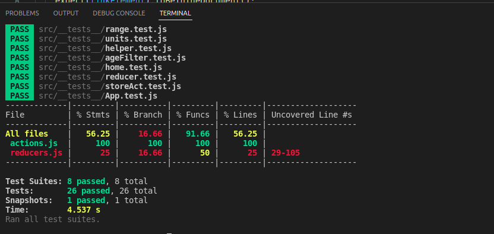

# age-of-empires

## In order to run this project in your local environment

 <br/>

```bash
git clone https://github.com/elifdiril/age-of-empires.git
```

And then

```bash
npm install
```

to install all the dependencies.

After started to server side:

```bash
npm start
```

to start the client side.


For checking the test coverage:

```bash
npm test -- --coverage
```


